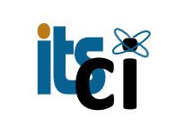

<h1>Python Data Analysis with Pandas and Matplotlib  Workshop</h1>
<h2>Date: April 17-18, 2018 9am-4:30pm</h2>
<h2>Location: Information Technology Center Room 105A/B, UH Manoa</h2>

<h3>Presenters: Mahdi Belcaid (HDSI) Sean Cleveland(UH), Ron Merrill (UH), David Schanzenbach (UH), and Jennifer Geis(UH)</h3>

This FREE workshop is sponsored by the Hawai'i Data Science Institue and the University of Hawai'i Information Technology Service Cyberinfrastructure group and Hawai'i EPSCoR.

This workshop focuses specifically on the Python skills necessary for data analysis -- as opposed to software development -- and introduces some of the libraries that have made Python a popular alternative for working with data at any scale.

Takeaways:

By the end of this workshop students will be able to:
* Work with the Pandas library to conduct essential data analysis tasks such as reading, exploring, filtering, and summarizing data.
* Slice, shape and pivot tables.
* Implement calculations on rows, columns, and tables.
* Use split-apply-combine to summarize data
* Merge, concatenate and filter data from multiple sources.
* Visualize data using matplotlib

The focus will be on data management and analysis for genomics research. We will cover metadata organization, data organization, connecting to and using advanced computing, the command line for sequence quality control and bioinformatics workflows, and R for data analysis and visualization. We will not be teaching any particular bioinformatics tools, but the foundational skills that will allow you to conduct any analysis and analyze the output of a genomics pipeline. By the end of the workshop learners should be able to manage and analyze data more effectively and be able to apply the tools and approaches directly to their ongoing research.

Participants should bring their laptops and plan to participate actively. Laptops will require a browser application for accessing jupyter notebooks resources.

Registration:
